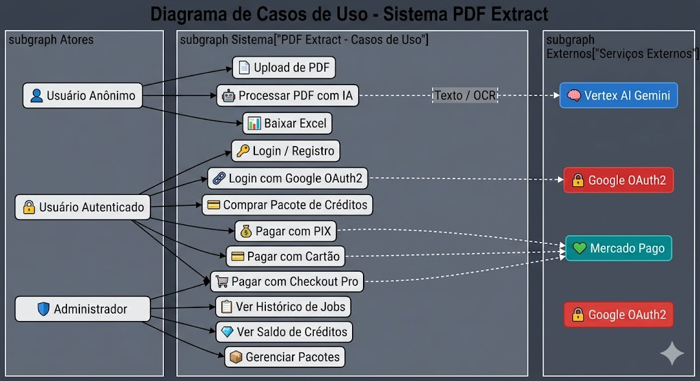

# PDF Extract

> Sistema backend em **Java 21** com **Spring Boot 3.2.5** para upload, processamento inteligente de PDFs e extração de dados estruturados para planilhas Excel, com integração com **Vertex AI (Gemini)**, sistema de créditos e pagamentos via **Mercado Pago**.

---

## Índice

- [Sobre o Projeto](#sobre-o-projeto)
- [Funcionalidades](#funcionalidades)
- [Arquitetura do Projeto](#arquitetura-do-projeto)
  - [Visão Geral](#visão-geral)
  - [Módulos](#módulos)
  - [Estrutura de Pastas](#estrutura-de-pastas)
  - [Bancos de Dados](#bancos-de-dados)
- [Tecnologias Utilizadas](#tecnologias-utilizadas)
  - [Vertex AI — Integração com Google Gemini](#vertex-ai--integração-com-google-gemini)
- [Design Patterns](#design-patterns)
- [Diagrama de Caso de Uso (UML)](#diagrama-de-caso-de-uso-uml)
- [CI/CD com GitHub Actions](#cicd-com-github-actions)
- [Manual de Setup Local com Docker](#manual-de-setup-local-com-docker)
- [API / Swagger](#api--swagger)

---

## Sobre o Projeto

O **PDF Extract** é uma aplicação backend que permite a usuários fazer upload de arquivos PDF e extrair dados estruturados automaticamente usando inteligência artificial. O sistema:

1. Recebe PDFs via API REST
2. Extrai texto do documento (ou faz OCR em documentos escaneados)
3. Envia o conteúdo para o **Google Gemini (Vertex AI)** para extração inteligente
4. Converte a resposta da IA em uma **planilha Excel (.xlsx)**
5. Gerencia **créditos** do usuário e integra com **Mercado Pago** para compra de pacotes

O frontend em Angular está disponível em [pdftoexcel.com.br](https://www.pdftoexcel.com.br).

---

## Funcionalidades

- **Upload e processamento de PDFs** — suporte a múltiplos arquivos
- **Extração inteligente com IA** — extração de campos definidos pelo usuário (nome, CPF, data, etc.)
- **Dual-mode de extração** — texto puro (PDFs nativos) e OCR multimodal (PDFs escaneados)
- **Geração de Excel** — conversão automática dos dados extraídos em `.xlsx`
- **Autenticação** — login local (email/senha) e **Google OAuth2** com JWT
- **Sistema de créditos** — cada extração consome créditos; usuários compram pacotes
- **Pagamentos** — integração com Mercado Pago (PIX, Cartão de Crédito, Checkout Pro)
- **Uso anônimo limitado** — controle por IP via Redis (rate limiting)
- **Logging de API** — registros de todas as requisições em MongoDB
- **Documentação OpenAPI** — Swagger UI integrado
- **Jobs de processamento** — tracking de cada processamento no banco de dados

---

## Arquitetura do Projeto

### Visão Geral

O projeto segue a arquitetura de **monólito modular**, com pacotes organizados por domínio de negócio. Cada módulo encapsula suas próprias camadas (controller, service, repository, DTOs, strategies, factories).

```
┌─────────────────────────────────────────────────────────────┐
│                        SPRING BOOT 3.2.5                    │
│                          (Java 21)                          │
├─────────────┬──────────────┬──────────────┬─────────────────┤
│   readpdf   │   Payment    │  loginpage   │  creditpackges  │
│  ─────────  │  ──────────  │  ──────────  │  ────────────── │
│  Controller │  Controller  │  Controllers │  Controller     │
│  Facade     │  Strategy    │  Auth/User   │  Service+Cache  │
│  AI Strategy│  Factory     │  Jobs        │  Repository     │
│  Excel Svc  │  Client/Wrap │  Credits     │                 │
│  PDF Svc    │  Webhook     │  Strategy    │                 │
├─────────────┴──────────────┴──────────────┴─────────────────┤
│  uploadfiles  │  security  │  logging  │  config  │ common  │
│  ───────────  │  ────────  │  ───────  │  ──────  │ ──────  │
│  StorageSvc   │  JWT+OAuth │  MongoDB  │  CORS    │ Logger  │
│  FileSystem   │  Redis     │  Intercept│  Cache   │         │
│               │  Filters   │           │  Storage │         │
├───────────────┴────────────┴───────────┴──────────┴─────────┤
│  PostgreSQL    │    MongoDB       │    Redis                 │
│  (dados)       │    (logs API)    │    (cache + rate limit)  │
└────────────────┴─────────────────┴───────────────────────────┘
```

### Módulos

| Módulo | Responsabilidade |
|--------|-----------------|
| **`readpdf`** | Core do sistema: orquestração PDF → IA → Excel via Facade, serviços de extração de texto, strategies de IA (texto/OCR) e geração de Excel |
| **`Payment`** | Integração com Mercado Pago: pagamentos PIX, cartão de crédito e Checkout Pro. Utiliza Strategy + Factory + Wrapper |
| **`loginpage`** | Autenticação e autorização: registro de usuários (local/OAuth2), gerenciamento de créditos com Strategy, jobs de processamento com Strategy |
| **`creditpackges`** | CRUD de pacotes de crédito, com cache Redis |
| **`uploadfiles`** | Armazenamento temporário de arquivos no filesystem local |
| **`security`** | Segurança: SecurityConfig, JWT filter, OAuth2 handler, Redis rate limiting, IP gate filter |
| **`logging`** | Interceptor que registra cada requisição HTTP no MongoDB (endpoint, tempo de resposta, usuário, créditos) |
| **`config`** | Configurações transversais: CORS, cache Redis, inicialização de storage |
| **`common`** | Utilitários compartilhados (ProgressLogger) |

### Estrutura de Pastas

```
src/main/java/com/example/pdf_extratct/
├── PdfExtratctApplication.java          # Classe principal
├── readpdf/
│   ├── controllers/
│   │   └── PdfController.java           # POST /api/pdf-to-excel
│   ├── dto/
│   │   └── PdfProcessingRequest.java
│   └── service/
│       ├── facade/
│       │   └── PdfProcessingFacadeService.java   # Orquestrador (Facade)
│       ├── aiservices/
│       │   ├── AiResponseParserService.java      # Parse JSON → Map
│       │   └── strategy/
│       │       ├── AiExtractionStrategy.java       # Interface Strategy
│       │       ├── AiExtractionFactory.java         # Factory
│       │       ├── AiExtractionContext.java         # Context (record)
│       │       ├── TextAiExtractionStrategy.java    # PDF com texto
│       │       └── VisionOcrAiExtractionStrategy.java # PDF escaneado (OCR)
│       ├── pdfservices/                  # Extração de texto do PDF
│       ├── excelservices/                # Geração de Excel (Apache POI)
│       ├── database/                     # Persistência de dados extraídos
│       └── ReadProperties/              # Configurações de extração
├── Payment/
│   ├── controller/
│   │   ├── CreatePaymentController.java
│   │   └── WebhookController.java
│   ├── strategy/
│   │   ├── PaymentStrategy.java          # Interface
│   │   ├── PixPaymentStrategy.java
│   │   ├── CreditCardPaymentStrategy.java
│   │   └── CheckoutProPaymentStrategy.java
│   ├── factory/
│   │   └── PaymentStrategyFactory.java
│   ├── service/
│   │   ├── PaymentService.java           # Interface
│   │   ├── PaymentServiceImpl.java
│   │   └── ProcessPaymentNotificationService.java
│   ├── client/
│   │   ├── MercadoPagoWrapper.java       # Interface (Adapter)
│   │   ├── MercadoPagoWrapperImpl.java
│   │   └── MercadoPagoClient.java
│   ├── dto/
│   ├── enums/
│   ├── config/
│   ├── models/
│   └── exceptions/
├── loginpage/
│   ├── auth/                             # AuthAccountEntity, OAuth2
│   │   └── service/
│   ├── user/
│   │   ├── UserEntity.java
│   │   ├── UserRepository.java
│   │   └── strategy/                     # UserCreationStrategy + Factory
│   ├── credittransaction/
│   │   ├── CreditTransactionEntity.java
│   │   ├── strategy/                     # Add, Debit, Refund, Bonus
│   │   └── factory/                      # CreditStrategyFactory
│   ├── controllers/
│   │   ├── AuthController.java
│   │   ├── CreditController.java
│   │   └── JobController.java
│   └── jobs/
│       ├── ProcessingJobEntity.java
│       ├── strategy/                     # Start, Complete, Fail, Cancel, Refund
│       ├── factory/                      # JobStatusStrategyFactory
│       └── creation/                     # JobCreationStrategy (Auth/Anon)
├── creditpackges/                        # Pacotes de crédito + Cache
├── uploadfiles/
│   └── storage/
│       └── service/
│           ├── StorageService.java       # Interface
│           └── FileSystemStorageService.java
├── security/
│   ├── config/
│   │   ├── SecurityConfig.java
│   │   ├── CorsConfig.java
│   │   └── SwaggerConfig.java
│   ├── filter/
│   │   ├── JwtAuthenticationFilter.java
│   │   └── IpGateFilter.java
│   ├── jwt/
│   │   └── JwtUtil.java
│   ├── oauth2/
│   │   └── OAuth2SuccessHandler.java
│   └── redis/
│       ├── RedisConfig.java
│       └── quota_usage/
│           └── IpBlockService.java
├── logging/
│   ├── ApiLoggingInterceptor.java        # HandlerInterceptor → MongoDB
│   ├── ApiLogDocument.java
│   ├── ApiLogRepository.java
│   ├── ApiLogContext.java
│   └── WebConfig.java
├── config/
│   ├── AppConfig.java
│   ├── CacheConfig.java
│   └── StorageInitConfig.java
└── common/
    └── logging/
        └── ProgressLogger.java
```

### Bancos de Dados

O sistema utiliza **3 bancos de dados** com propósitos distintos:

| Banco | Propósito | Driver/Lib |
|-------|-----------|-----------|
| **PostgreSQL** | Dados relacionais: usuários, créditos, transações, jobs, pacotes, contas de auth | Spring Data JPA + Hibernate |
| **MongoDB** | Logs de API: cada requisição HTTP é registrada como documento | Spring Data MongoDB |
| **Redis** | Cache (pacotes de crédito), rate limiting por IP, controle de uso anônimo | Spring Data Redis |

---

## Tecnologias Utilizadas

### Core

| Tecnologia | Versão | Uso |
|-----------|--------|-----|
| **Java** | 21 | Linguagem principal (com Virtual Threads habilitadas) |
| **Spring Boot** | 3.2.5 | Framework principal |
| **Maven** | Wrapper | Build e gerenciamento de dependências |

### Spring Ecosystem

| Módulo | Uso |
|--------|-----|
| **Spring Web** | API REST (controllers, multipart upload) |
| **Spring Validation** | Validação de DTOs e requests |
| **Spring Data JPA** | ORM para PostgreSQL (Hibernate) |
| **Spring Data MongoDB** | Acesso ao MongoDB (logs de API) |
| **Spring Data Redis** | Cache, rate limiting, sessões |
| **Spring Cache** | Abstração de cache (Redis backing) |
| **Spring Security** | Autenticação e autorização |
| **Spring OAuth2 Client** | Login com Google |
| **Spring AI** | Integração com Vertex AI Gemini (BOM `1.0.0`) |
| **Spring DevTools** | Hot reload em desenvolvimento |

### Infraestrutura

| Tecnologia | Versão | Uso |
|-----------|--------|-----|
| **PostgreSQL** | — | Banco relacional principal |
| **MongoDB** | — | Armazenamento de logs de API |
| **Redis** | — | Cache e rate limiting |
| **Docker** | Multi-stage | Containerização (JDK 21 build + JRE 21 runtime) |
| **Docker Compose** | — | Orquestração de containers |
| **GitHub Actions** | — | CI/CD (build, test, deploy) |

### Bibliotecas

| Biblioteca | Versão | Uso |
|-----------|--------|-----|
| **Spring AI PDF Reader** | 1.0.0 | Extração de texto de PDFs |
| **Spring AI Vertex AI Gemini** | 1.0.0 | Integração com Google Gemini |
| **Mercado Pago SDK** | 2.8.0 | Pagamentos (PIX, Cartão, Checkout Pro) |
| **Apache POI** | 5.3.0 | Geração de planilhas Excel (.xlsx) |
| **jjwt (jsonwebtoken)** | 0.12.3 | Geração e validação de tokens JWT |
| **Lombok** | — | Redução de boilerplate (getters, builders, etc.) |
| **SpringDoc OpenAPI** | 2.5.0 | Swagger UI e documentação da API |
| **Testcontainers** | — | MongoDB em containers para testes |
| **H2 Database** | — | Banco in-memory para testes JPA |
| **Spring Security Test** | — | Utilitários de teste para segurança |

---

### Vertex AI — Integração com Google Gemini

A integração com **Vertex AI** é o coração do sistema de extração inteligente. Ela utiliza o modelo **Gemini 2.5 Flash** do Google, acessado via **Spring AI**.

#### Configuração

```yaml
# application.yaml
spring:
  ai:
    vertex:
      ai:
        gemini:
          project-id: "iotska121"
          location: "us-central1"
          chat:
            options:
              model: "gemini-2.5-flash"
              temperature: 0.1
```

**Autenticação**: via `GOOGLE_APPLICATION_CREDENTIALS` (Service Account JSON montado no container Docker).

#### Como funciona

O sistema decide **automaticamente** qual estratégia de extração usar, baseado na qualidade do texto extraído do PDF:

```
                   ┌─────────────────────────┐
                   │  PDF recebido (upload)   │
                   └────────────┬────────────┘
                                │
                   ┌────────────▼────────────┐
                   │  Extrair texto do PDF    │
                   │  (Spring AI PDF Reader)  │
                   └────────────┬────────────┘
                                │
                   ┌────────────▼────────────┐
                   │  Texto extraído >= 200   │
                   │  caracteres?             │
                   └─────┬──────────────┬─────┘
                    SIM  │              │  NÃO
            ┌────────────▼──┐    ┌──────▼────────────┐
            │   Estratégia  │    │   Estratégia       │
            │   TEXT         │    │   VISION/OCR       │
            │   (texto puro) │    │   (multimodal)     │
            └────────┬──────┘    └──────┬─────────────┘
                     │                  │
                     │  Envia texto     │  Envia PDF como
                     │  ao Gemini       │  mídia ao Gemini
                     └────────┬─────────┘
                              │
                   ┌──────────▼──────────┐
                   │  Gemini retorna     │
                   │  JSON estruturado   │
                   └──────────┬──────────┘
                              │
                   ┌──────────▼──────────┐
                   │  Parse JSON → Excel │
                   │  (Apache POI)       │
                   └─────────────────────┘
```

#### Classes envolvidas

- **`VertexAiGeminiChatModel`** (Spring AI) — client de chat que se comunica com a API Vertex AI
- **`TextAiExtractionStrategy`** — para PDFs com texto selecionável (≥ 200 chars). Monta um `Prompt` com `SystemMessage` (instruções de extração) + `UserMessage` (texto do PDF), chama `chatModel.call()` e recebe JSON
- **`VisionOcrAiExtractionStrategy`** — para PDFs escaneados/imagem (< 200 chars). Monta `Media` objects com os PDFs físicos (`MimeType: application/pdf`), envia como entrada multimodal para OCR via Gemini
- **`AiExtractionFactory`** — Factory que seleciona automaticamente a strategy com base em `supports(textLength)`
- **`AiResponseParserService`** — converte o JSON retornado pela IA em `List<Map<String, String>>` usando Jackson

#### Exemplo de Prompt enviado ao Gemini

```
[SystemMessage]
Extraia APENAS estes campos: [Nome, CPF, Data de Nascimento]

Responda SOMENTE com JSON válido.
Formato:
[
  {"nome":"...", "cpf":"..."}
]

NÃO use markdown.
NÃO use ```json.
NÃO escreva explicações.

[UserMessage]
<texto completo extraído do PDF>
```

#### Problema resolvido

O Vertex AI Gemini resolve o problema de **extração de dados estruturados de PDFs arbitrários**. Sem ele, seria necessário criar parsers customizados para cada formato de PDF. Com a IA, o usuário apenas define os campos desejados (headers) e o modelo extrai automaticamente, funcionando tanto para PDFs com texto nativo quanto para documentos escaneados via OCR.

---

## Design Patterns

O projeto faz uso extensivo de **8 design patterns**, com forte ênfase em **Strategy + Factory** para desacoplamento.

### 1. Strategy

O padrão Strategy encapsula algoritmos intercambiáveis, permitindo que o comportamento varie em runtime. O projeto o aplica em **6 contextos**:

#### 1.1 Extração de IA

```java
public interface AiExtractionStrategy {
    boolean supports(int textLength);
    String extract(ExtractionHeaders headers, AiExtractionContext context);
}
```

**Implementações:**
- `TextAiExtractionStrategy` — texto puro para Gemini (`supports: textLength >= 200`)
- `VisionOcrAiExtractionStrategy` — OCR multimodal com PDFs físicos (`supports: textLength < 200`)

#### 1.2 Pagamento

```java
public interface PaymentStrategy {
    PaymentType getType();
    PaymentResult execute(PaymentRequest request, String userId, Integer packageId);
}
```

**Implementações:** `PixPaymentStrategy`, `CreditCardPaymentStrategy`, `CheckoutProPaymentStrategy`

#### 1.3 Transação de Crédito

```java
public interface CreditTransactionStrategy {
    CreditTransactionData createTransaction(UserEntity user, Integer amount,
                                            String description, String relatedId);
    boolean validateBalance(UserEntity user, Integer amount);
    TransactionType getTransactionType();
}
```

**Implementações:** `AddCreditStrategy`, `DebitCreditStrategy`, `RefundCreditStrategy`, `BonusCreditStrategy`

#### 1.4 Status de Job

```java
public interface JobStatusStrategy {
    // Gerencia transições de estado dos jobs de processamento
}
```

**Implementações:** `StartProcessingStrategy`, `CompleteJobStrategy`, `FailJobStrategy`, `CancelJobStrategy`, `RefundJobStrategy`

#### 1.5 Criação de Job

```java
public interface JobCreationStrategy {
    ProcessingJobEntity create(JobCreationContext context);
}
```

**Implementações:** `AuthenticatedJobCreationStrategy`, `AnonymousJobCreationStrategy`

#### 1.6 Criação de Usuário

```java
public interface UserCreationStrategy {
    AuthProvider getProviderName();
    UserEntity createUser(UserRegisterRequestDto request);
    AuthAccountEntity createAuthAccount(UserEntity user, UserRegisterRequestDto request,
                                         PasswordEncoder encoder);
}
```

**Implementações:** por `AuthProvider` (LOCAL, GOOGLE)

---

### 2. Factory

Cada conjunto de Strategies possui uma Factory correspondente que o Spring injeta automaticamente:


### 3. Facade

O `PdfProcessingFacadeService` é o orquestrador central do fluxo PDF → Excel. Ele **esconde a complexidade** de 8+ serviços internos do controller:

### 4. Adapter (Wrapper)

O `MercadoPagoWrapper` abstrai o SDK do Mercado Pago atrás de uma interface, permitindo substituição em testes:

### 5. Builder

Utilizado extensivamente com records Lombok (`@Builder`) e nos objetos de request do Mercado Pago:

### 6. Interceptor

O `ApiLoggingInterceptor` implementa `HandlerInterceptor` do Spring MVC para registrar cada requisição HTTP no MongoDB:


## Diagrama de Caso de Uso (UML)



### Fluxo Principal — PDF para Excel


O projeto utiliza um workflow de **Build & Deploy** automatizado via GitHub Actions, disparado a cada push na branch `main`.

### Workflow: `deploy.yml`

```
┌───────────────────────────────────────────────────────────────┐
│                    Push na branch main                         │
└────────────────────────┬──────────────────────────────────────┘
                         │
              ┌──────────▼──────────┐
              │    Job 1: BUILD     │
              │   (ubuntu-latest)   │
              ├─────────────────────┤
              │ 1. Checkout code    │
              │ 2. Setup JDK 21    │
              │    (Temurin)        │
              │ 3. Cache Maven     │
              │ 4. mvnw clean      │
              │    verify -B       │
              │    (build + tests) │
              └──────────┬─────────┘
                         │ ✅ Sucesso
              ┌──────────▼──────────┐
              │    Job 2: DEPLOY    │
              │   (ubuntu-latest)   │
              │   needs: build      │
              ├─────────────────────┤
              │ 1. Checkout code    │
              │ 2. Docker build     │
              │ 3. Docker save      │
              │    (.tar.gz)        │
              │ 4. SCP image →      │
              │    servidor         │
              │ 5. SCP compose →    │
              │    servidor         │
              │ 6. SSH deploy:      │
              │    - docker load    │
              │    - escreve .env   │
              │    - escreve creds  │
              │    - compose down   │
              │    - compose up -d  │
              │    - image prune    │
              └─────────────────────┘
```

### Detalhamento das etapas

| Etapa | Job | Ação | Detalhes |
|-------|-----|------|---------|
| **Trigger** | — | `push` → `main` | Apenas pushes na branch principal |
| **Checkout** | build | `actions/checkout@v4` | Clona o repositório |
| **Setup JDK** | build | `actions/setup-java@v4` | JDK 21 Temurin com cache Maven |
| **Build & Test** | build | `mvnw clean verify -B` | Compila, roda testes unitários/integração |
| **Docker Build** | deploy | `docker build -t pdf-extract-api:latest .` | Multi-stage: JDK 21 build → JRE 21 runtime |
| **Docker Save** | deploy | `docker save \| gzip` | Empacota imagem como `.tar.gz` |
| **SCP Image** | deploy | `appleboy/scp-action@v0.1.7` | Copia imagem para `/tmp/` do servidor |
| **SCP Compose** | deploy | `appleboy/scp-action@v0.1.7` | Copia `docker-compose.yml` para `APP_DIR` |
| **SSH Deploy** | deploy | `appleboy/ssh-action@v1.0.3` | Executa deploy no servidor remoto |

### GitHub Secrets utilizados

| Secret | Uso |
|--------|-----|
| `SERVER_HOST`, `SERVER_USER`, `SERVER_PASSWORD` | Acesso SSH ao servidor |
| `APP_DIR` | Diretório da aplicação no servidor |
| `DB_URL`, `DB_USERNAME`, `DB_PASSWORD` | PostgreSQL |
| `REDIS_HOST`, `REDIS_PASSWORD` | Redis |
| `MONGO_USERNAME`, `MONGO_PASSWORD`, `MONGO_HOST` | MongoDB |
| `JWT_SECRET` | Assinatura de tokens JWT |
| `GOOGLE_CLIENT_ID`, `GOOGLE_CLIENT_SECRET` | OAuth2 Google |
| `GOOGLE_CREDENTIALS_JSON` | Service Account para Vertex AI |
| `MP_ACCESS_TOKEN_PROD`, `MP_ACCESS_TOKEN_TEST` | Mercado Pago |
| `MP_NOTIFICATION_URL`, `MP_PUBLIC_KEY` | Mercado Pago webhooks |
| `ALLOWED_ORIGINS` | CORS (frontend URL) |

---

## Manual de Setup Local com Docker

### Pré-requisitos

- **Docker** ≥ 20.x e **Docker Compose** ≥ 2.x
- **Git**
- Conta **Google Cloud** com Vertex AI habilitado (para obter o `google-credentials.json`)
- Acesso a instâncias de **PostgreSQL**, **Redis** e **MongoDB** (locais ou remotas)
- Credenciais do **Mercado Pago** (access tokens de teste)
- Credenciais do **Google OAuth2** (client ID e secret)

### Passo 1 — Clonar o repositório

```bash
git clone https://github.com/seu-usuario/pdf_extract.git
cd pdf_extract/pdf_extratct
```

### Passo 2 — Configurar variáveis de ambiente

```bash
cp .env.example .env
```

Edite o arquivo `.env` com seus valores reais:

```env
# --- PostgreSQL ---
DB_URL=jdbc:postgresql://localhost:5432/pdf_extract
DB_USERNAME=postgres
DB_PASSWORD=sua_senha

# --- Redis ---
REDIS_HOST=localhost
REDIS_PORT=6379
REDIS_USERNAME=default
REDIS_PASSWORD=sua_senha_redis

# --- MongoDB ---
MONGO_USERNAME=app_user
MONGO_PASSWORD=sua_senha_mongo
MONGO_HOST=localhost
MONGO_PORT=27017
MONGO_DATABASE=pdf_extract_logs
MONGO_AUTH_DB=admin

# --- JWT ---
JWT_SECRET=sua_chave_jwt_base64
JWT_EXPIRATION=86400000

# --- Google OAuth2 ---
GOOGLE_CLIENT_ID=seu_client_id.apps.googleusercontent.com
GOOGLE_CLIENT_SECRET=GOCSPX-seu_secret

# --- Mercado Pago ---
MP_ACCESS_TOKEN_PROD=APP_USR-xxxxx
MP_ACCESS_TOKEN_TEST=TEST-xxxxx
MP_NOTIFICATION_URL=https://seudominio.com/api/v1/webhooks/mercadopago
MP_PUBLIC_KEY=APP_USR-xxxxx

# --- Spring ---
SPRING_PROFILES_ACTIVE=prod
HIBERNATE_DDL_AUTO=update
SHOW_SQL=true

# --- CORS ---
ALLOWED_ORIGINS=http://localhost:4200
```

### Passo 3 — Configurar credenciais do Google Cloud

Coloque seu arquivo de Service Account na raiz do módulo:

```bash
cp /caminho/para/seu/service-account.json ./google-credentials.json
```

> ⚠️ **Importante**: Este arquivo é necessário para autenticação com o Vertex AI. Nunca commite este arquivo!

### Passo 4 — Criar a rede Docker (se necessário)

Se seus bancos de dados (PostgreSQL, Redis, MongoDB) rodam em containers na rede `supabase_default`:

```bash
docker network create supabase_default
```

Se rodam localmente (fora do Docker), ajuste o `docker-compose.yml` para usar `network_mode: host` ou remova a configuração de rede.

### Passo 5 — Build e execução

```bash
# Build da imagem Docker
docker build -t pdf-extract-api:latest .

# Subir o container
docker compose up -d
```

### Passo 6 — Verificar se está rodando

```bash
# Verificar logs
docker compose logs -f app

# Verificar status do container
docker ps

# Testar health (Swagger UI)
curl http://localhost:8080/swagger-ui.html
```

**Sinais de sucesso:**
- ✅ Log mostrando `Started PdfExtratctApplication in X seconds`
- ✅ Swagger UI acessível em `http://localhost:8080/swagger-ui.html`
- ✅ Container `pdf-extract-api` com status `Up`

### Alternativa: Execução sem Docker (desenvolvimento)

```bash
# Na raiz do módulo pdf_extratct/
./mvnw spring-boot:run
```

Requer JDK 21 instalado localmente e todas as variáveis de ambiente configuradas (ou um `.env` carregado via IDE).

---

## API / Swagger

A documentação interativa da API está disponível via Swagger UI:

- **Swagger UI**: `http://localhost:8080/swagger-ui.html`
- **OpenAPI JSON**: `http://localhost:8080/v3/api-docs`

### Endpoints principais

| Método | Endpoint | Descrição | Auth |
|--------|----------|-----------|------|
| `POST` | `/api/files` | Upload de arquivos PDF | JWT/Anônimo |
| `POST` | `/api/pdf-to-excel` | Processar PDF → Excel | JWT/Anônimo |
| `POST` | `/api/auth/register` | Registro de usuário | Público |
| `POST` | `/api/auth/login` | Login (email/senha) | Público |
| `GET` | `/api/credit-packages` | Listar pacotes de créditos | Público |
| `POST` | `/api/v1/payments/create` | Criar pagamento | Público |
| `POST` | `/api/v1/webhooks/mercadopago` | Webhook do Mercado Pago | Público |
| `GET` | `/api/credits/**` | Consultar créditos/transações | JWT |
| `GET` | `/api/jobs/**` | Consultar jobs de processamento | JWT |
| `GET` | `/login/oauth2/code/google` | Callback OAuth2 Google | Público |

---

## Licença

Este projeto é privado e de uso interno.
